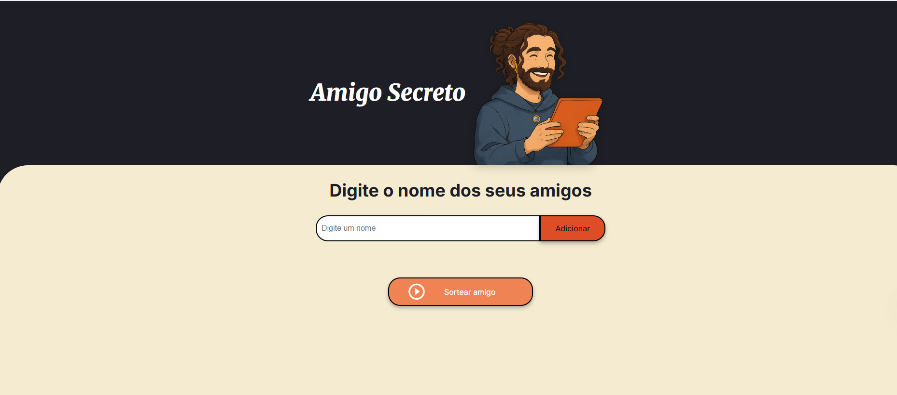

# 🎁 Sorteador de Amigo Secreto

Um pequeno aplicativo web para fazer sorteios de **amigo secreto** de forma prática, rápida e divertida. Ideal para festas, grupos de amigos, famílias ou equipes de trabalho!

---

## 🔹 Funcionalidades

- Interface moderna, leve e responsiva
- Cadastro intuitivo dos participantes
- Visualização automática da lista de nomes
- Sorteio justo com apenas um clique
- Pronto para rodar direto no navegador

---

## 🚀 Como Usar

1. **Baixe ou clone** este repositório.
2. **Abra** o arquivo `index.html` no seu navegador favorito.
3. **Adicione cada participante** no campo de nome e clique em **Adicionar**.
4. **Quando todos estiverem na lista**, clique em **Sortear amigo**.
5. **Veja o resultado** do sorteio na tela!

---

## 🖼️ Tela

> Veja abaixo como é a tela inicial do sorteador:
>
> 
>

>

>
> 

---

## 📁 Estrutura dos Arquivos

- **`index.html`**  
  Estrutura principal da página

- **`style.css`**  
  Responsável pela aparência, cores e responsividade

- **`app.js`**  
  Onde fica toda a lógica do sorteador

---

## 💻 Tecnologias Utilizadas

- HTML5
- CSS3
- JavaScript (puro)

---

## 🧩 Aprendizados e Desafios

Uma das maiores dificuldades durante o desenvolvimento desse projeto foi utilizar o **laço for** em JavaScript da maneira correta, seja para percorrer listas ou manipular os dados dos participantes. Apesar do desafio, foi gratificante aprofundar o conhecimento em estruturas de repetição e lógica de programação!

---

## ⚠️ Observação Importante

> Este sorteador revela **um sorteado por vez** e não impede repetições automáticas ou o sorteio de si mesmo.  
> Para um sorteio completamente tradicional (onde ninguém tira seu próprio nome e todos tiram alguém diferente), é necessário adaptar a lógica.

---

## 📌 Ideias Futuras

- Sorteio secreto para todos sem repetições
- Exportar resultados
- Novos temas (escuro, claro)
- Tradução para outros idiomas

---

## 🙋‍♂️ Desenvolvido por

[Lucas](https://github.com/EnginnerLuc4s)

Se você curtiu, compartilhe ou deixe uma ⭐ no projeto!

---
